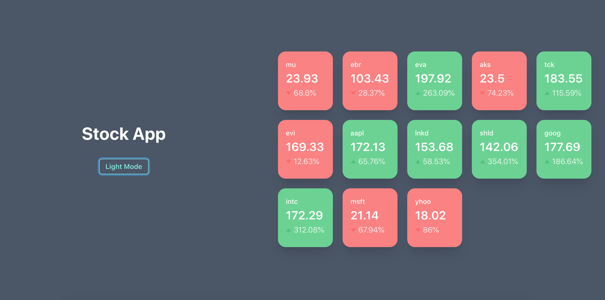
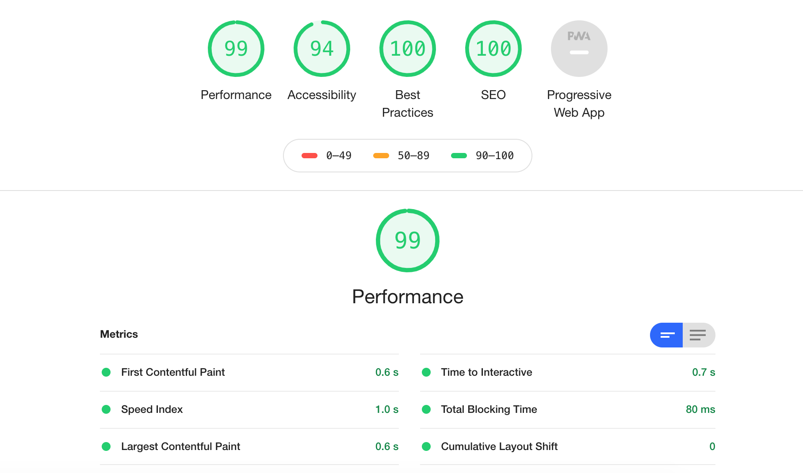

# Stocks App

Demo
https://codemayank.github.io/stocks-app

Note: For this site to work correctly in your browser please enable allow insecure content for this site in your browser. This is because the app uses websockets to fetch the latest stock data and the websocket server is running on an inscure endpoint.

Screenshots
Dark Mode

Light Mode

To run this app locally clone the repo and run
`yarn install && yarn start`

## This project was built using
* React
* Typescript
* Create React App
* Chakra Ui

## Lighthouse Report

[Full Report](./Lighthouse/lighthouse_report.json)

